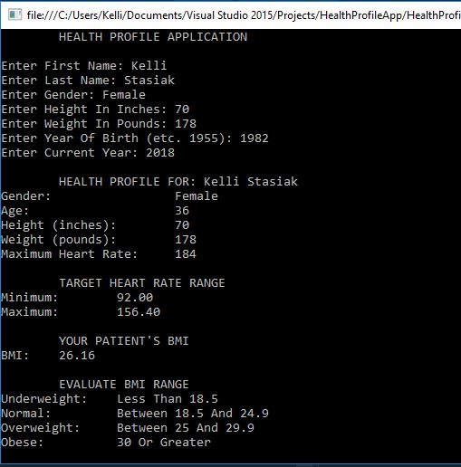

# HealthApp
C# Application

## Assignment Details

In this exercise, you’ll design a “starter” HealthProfile class for a person. The class attributes
should include the person’s first name, last name, gender, date of birth (consisting of separate
attributes for the month, day and year of birth), height (in inches) and weight (in pounds). Your class
should have a constructor that receives this data. For each attribute provide a property with set and
get accessors. The class also should include methods that calculate and return the user’s age in years,
maximum heart rate and target-heart-rate range, and body mass index.
The formulas for calculating the BMI are: http://extoxnet.orst.edu/faqs/dietcancer/web2/twohowto.html (Links to an external site.)Links to an external site.
According to the American Heart Association (AHA) (www.heart.org/HEARTORG/GettingHealthy/PhysicalActivity/ (Links to an external site.)Links to an external site.
Target-Heart-Rates_UCM_434341_Article.jsp (Links to an external site.)Links to an external site.), the formula for calculating your maximum heart rate
in beats per minute is 220 minus your age in years. Your target heart rate is a range that is 50–85% of
your maximum heart rate. [Note: These formulas are estimates provided by the AHA. Maximum and
target heart rates may vary based on the health, fitness and gender of the individual. Always consult a
physician or qualified health care professional before beginning or modifying an exercise program.]
Write an app that prompts for the person’s information, instantiates an object of
class HealthProfile for that person and displays the information from that object—including the
person’s first name, last name, gender, date of birth, height and weight—then calculates and displays
the person’s age in years, BMI, maximum heart rate and target-heart-rate range. It should also
display the “BMI values” chart from http://www.cancer.org/cancer/cancercauses/dietandphysicalactivity/bodyweightandcancerrisk/body-weight-and-cancer-risk-adult-bmi (Links to an external site.)Links to an external site.

## Output

